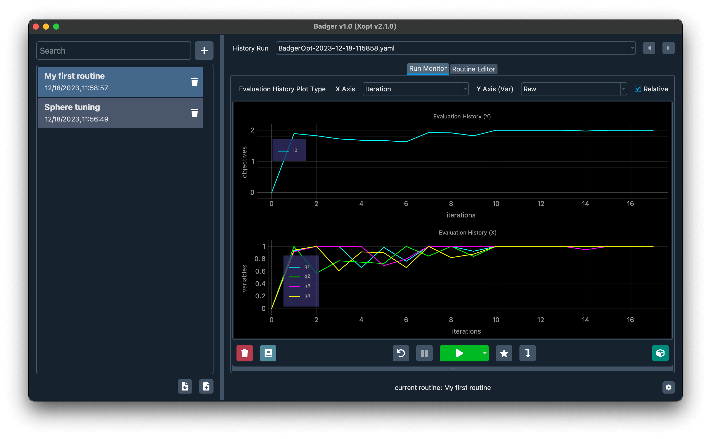

<div align="center">
  <h1 align="center">
    Badger: The Missing Optimizer in ACR
    <br />
    <br />
    <a href="https://slac-ml.github.io/Badger">
      
    </a>
  </h1>
</div>



<div align="center">

| Documentation | Package | Downloads | Version | Platforms |
| --- | --- | --- | --- | --- |
| [](https://slac-ml.github.io/Badger/) | [](https://anaconda.org/conda-forge/badger-opt) | [](https://anaconda.org/conda-forge/badger-opt) | [](https://anaconda.org/conda-forge/badger-opt) | [](https://anaconda.org/conda-forge/badger-opt) |

</div>

## Introduction

Badger is an optimization interface tailored for the Accelerator Control Room (ACR), drawing inspiration from [Ocelot the optimizer](https://github.com/ocelot-collab/optimizer). It places a strong emphasis on extensibility, easily expandable through the plugin system, and flexibility, offering complete GUI, CLI, and API support.

The primary goal of Badger is to establish a user-friendly interface (GUI, CLI, and API) bridging the gap between users and the machines undergoing optimization. Users only need to define an environment for each machine or simulation, allowing Badger to take charge of tasks such as connecting the problem and optimization algorithm, implementing control logic, visualizing progress, and archiving data.

Internally, Badger leverages the [Xopt](https://github.com/ChristopherMayes/Xopt/tree/main) optimization library to drive the optimization process. This grants users the advantage of utilizing a variety of optimization algorithms available through [Xopt](https://christophermayes.github.io/Xopt/index.html).

Badger boasts a range of features designed to enhance your optimization experience:

- **Plugin System:** Easily add your optimization problem in just a few minutes.
- **Versatile Modes:** Enjoy full support for three modes: GUI, CLI, and API, allowing you to use Badger according to your preferences.
- **Efficient Rerun:** With a single click or command, rerun optimization tasks swiftly—ideal for daily machine operation routines.
- **History Exploration:** Browse through past runs effortlessly.
- **Optimal Solution Navigation:** Jump to or set optimal solutions.
- **State Recovery:** Easily recover machine states after an optimization run.
- **Constraint Support:** Accommodate both soft and hard constraints.
- **Data Preservation:** Preserve all raw data for comprehensive analysis.
- **Advanced Extensions:** Benefit from extensions for sophisticated optimization data analysis and visualization.

For additional details about Badger and its capabilities, please refer to [Badger's online documentation](https://slac-ml.github.io/Badger/).

## Installation

Using `conda`

```shell
conda install -c conda-forge badger-opt
```

or `pip`

```shell
pip install badger-opt
```

### Run an optimization

Once Badger is installed, launch the GUI by running the following command in the terminal:

```bash
badger -g
```

Then following [this simple GUI tutorial](https://slac-ml.github.io/Badger/docs/next/getting-started/tutorial_0) to run your first optimizaion in Badger within a couple of minutes!

### Citation

If you use Badger for your research, please consider adding the following citation to your publications.

```
Zhang, Z., et al. "Badger: The missing optimizer in ACR",
in Proc. IPAC'22, Bangkok. doi:10.18429/JACoW-IPAC2022-TUPOST058
```

BibTex entry:
```bibtex
@inproceedings{Badger,
    author       = {Z. Zhang and M. Böse and A.L. Edelen and J.R. Garrahan and Y. Hidaka and C.E. Mayes and S.A. Miskovich and D.F. Ratner and R.J. Roussel and J. Shtalenkova and S. Tomin and G.M. Wang},
    title        = {{Badger: The Missing Optimizer in ACR}},
    booktitle    = {Proc. IPAC'22},
    pages        = {999--1002},
    eid          = {TUPOST058},
    language     = {english},
    keywords     = {interface, controls, GUI, operation, framework},
    venue        = {Bangkok, Thailand},
    series       = {International Particle Accelerator Conference},
    number       = {13},
    publisher    = {JACoW Publishing, Geneva, Switzerland},
    month        = {07},
    year         = {2022},
    issn         = {2673-5490},
    isbn         = {978-3-95450-227-1},
    doi          = {10.18429/JACoW-IPAC2022-TUPOST058},
    url          = {https://jacow.org/ipac2022/papers/tupost058.pdf},
}
```

### Issues or questions?

Please check out current Badger issues [here](https://github.com/slaclab/Badger/issues) before [opening a new one](https://github.com/slaclab/Badger/issues/new/). Alternatively, you are welcome to [shoot us an email](mailto:zhezhang@slac.stanford.edu), or join our [Slack channel](https://join.slack.com/share/enQtNjI3NjY0NDk0MzUxMC0zNThjYTdmNmZlOTA3MzM2NjFjZTVmNDY5MDk4NmQ2NmQxMjE1NjBjN2VhNzYxNjBjYjgxYzMwY2ExZTIxYzkw).
